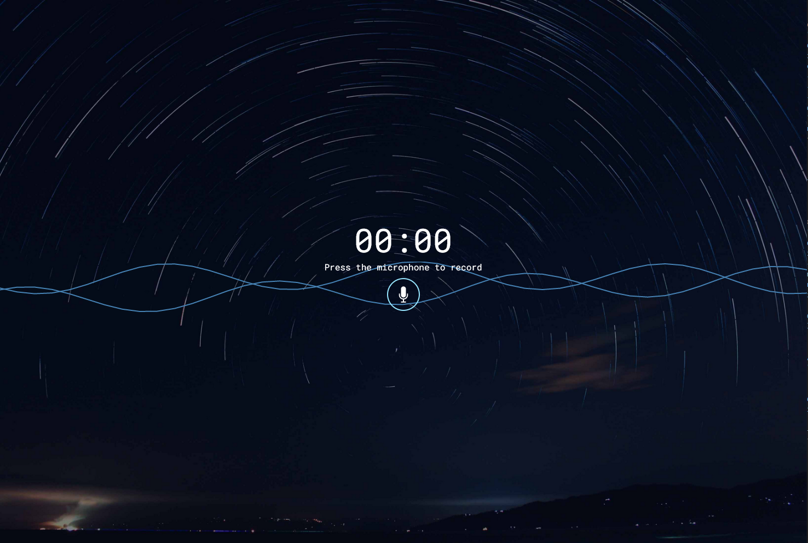
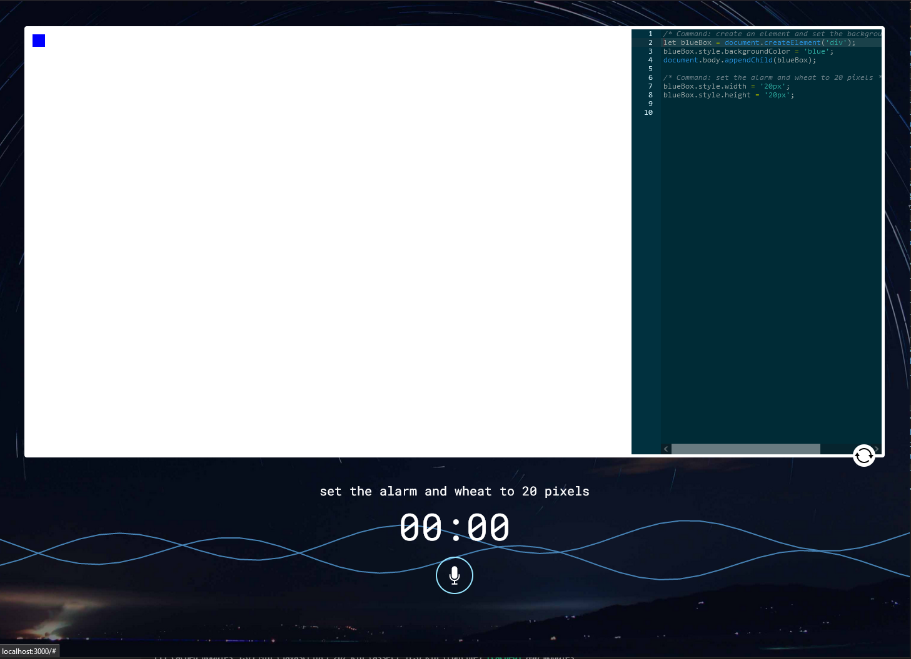
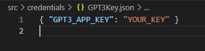

# Create a javascript web app by speaking.

It's funny because even though I didn't record properly GPT3 could still figure out what I want.

# To run it
## Inside credentials folder create a .json file named: GPT3Key.json, which should look like this:

## Create a google cloud account and activate speech to text. Set the environment variable as instructed here:
https://cloud.google.com/docs/authentication/getting-started
eg: $env:GOOGLE_APPLICATION_CREDENTIALS="C:\Users\username\Downloads\service-account-file.json"

## Oh, have Node installed.

## Run it!
npm run start

This project was bootstrapped with [Create React App](https://github.com/facebook/create-react-app).
